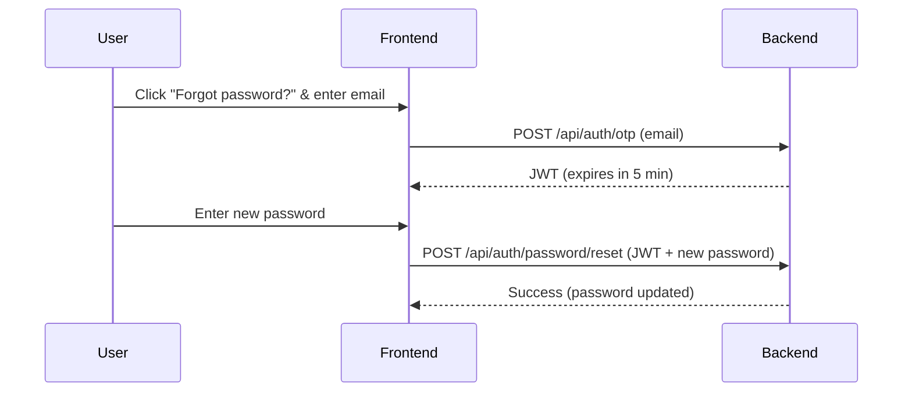

# Instructions

Almost every detail about the API's auth section is given in the documentation, but I will put some instructions here just in case.

> [!NOTE]
> All the details about the request body are given in the API docs. Please read it and test the API for yourself on the docs page before using API calls.

## Sign Up

The view (`api/auth/signup`) can only be accessed by a `LEAD` user. Because of this, we cannot create any user from the website as there's no `LEAD` user. So we create a `LEAD` user from Django's admin 
panel. And now the view can be used.

## Login

This view (`api/auth/login`) can be accessed by anyone. Email or roll number can also be used. But do note that the key `username` must not be changed in the request body.

## Logout

No need to send anything in the request body as it will use the token for authentication.

## Password Reset

This process combines two endpoints: `api/auth/otp` and `api/auth/password/reset`.
Because only a LEAD user can register new users, the LEAD sets an initial password during registration. The new user is then expected to change it as soon as possible.

The typical flow:

1. The user clicks "Forgot password?" and enters their email.
2. A request is sent to `auth/otp`, which responds with a short-lived JWT (expires in 5 minutes).
3. The user sends this JWT along with their new password to `auth/password/reset`.
4. The password is updated if the token is valid and unexpired.

This method ensures security while respecting the "LEAD-only register" requirement. 

